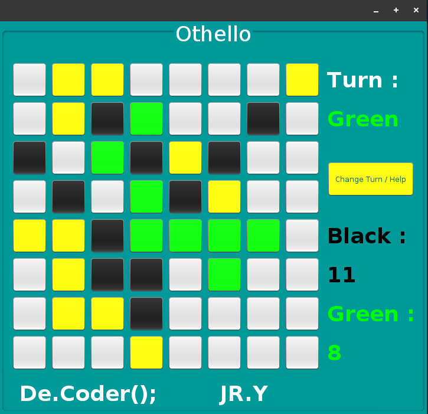

# Othello-Game-V2

My 6th project was in the "Advance Programming" course at spring 2016 when I was in the 2nd semester of my bachelor's at IAUSTB. Othello or Reversi is a strategy board game played between 2 players. One player plays black and the other white. Each player gets 32 discs and black always starts the game. The goal is to get the majority of colour discs on the board at the end of the game. The board will start with 2 black discs and 2 white discs at the centre of the board. White is forming a North-West to South-East direction. When a player has no valid moves, he pass his turn and the opponent continues. A player can not voluntarily forfeit his turn. When both players can not make a valid move the gane ends.

# Tutorial Videos
I have explained how to write the code of this game in the form of several tutorial videos. To view these videos, refer to this link: https://youtube.com/playlist?list=PL1y-Wxcd3C6AF53Y4Rr8eyP5eZ0ZsChUa

|  | 
|:--:| 
| *Version TWo* |

